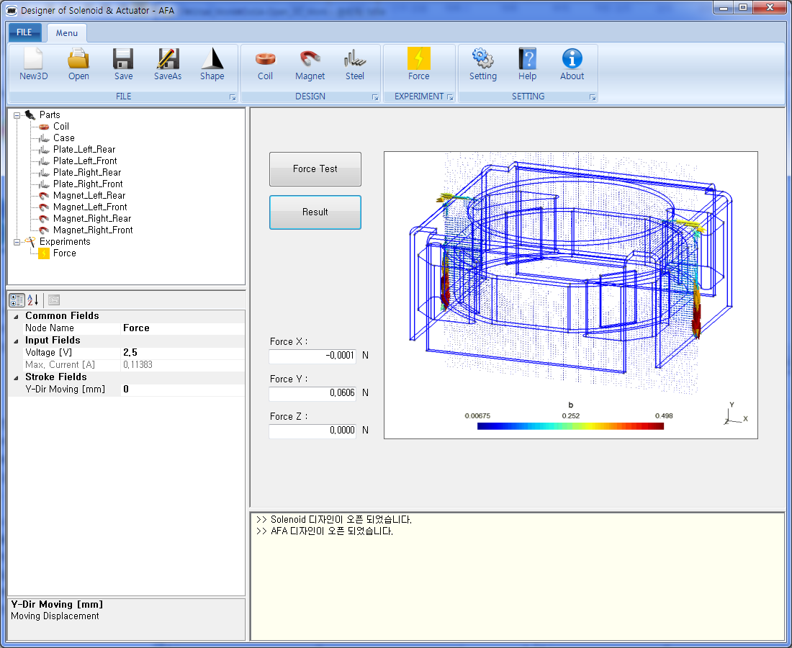
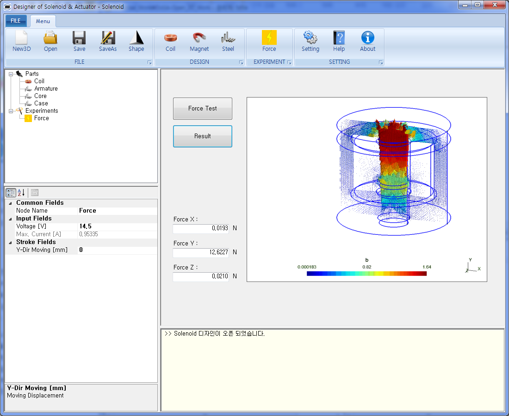
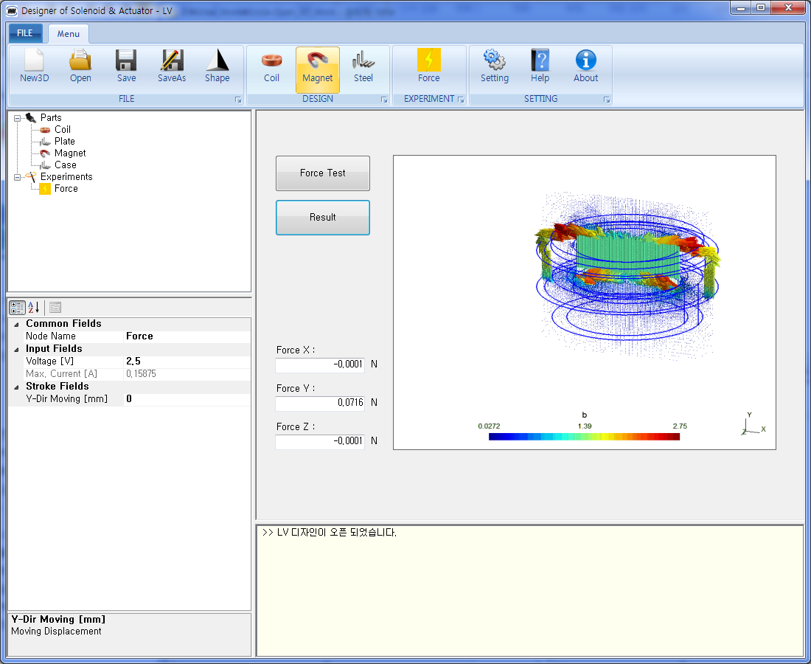
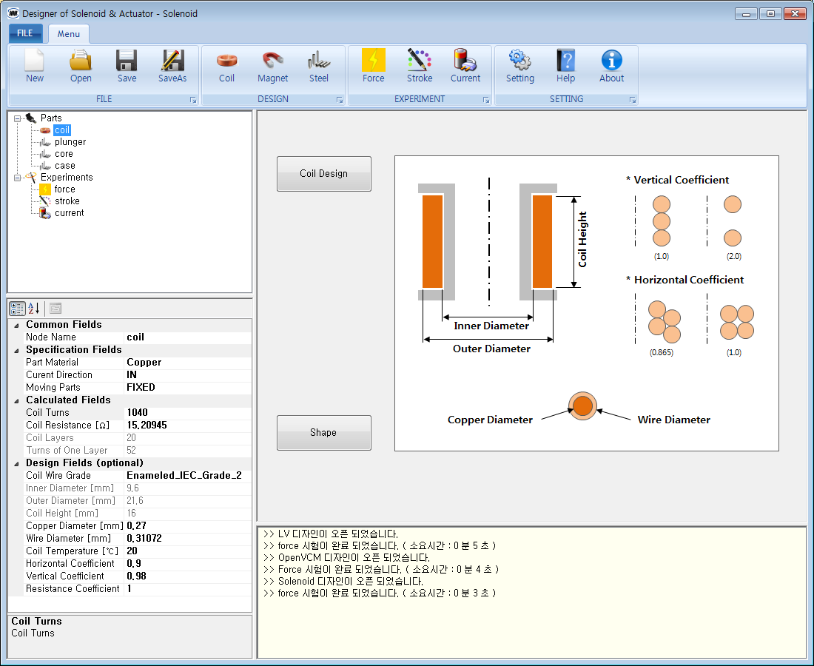

# DoSA-3D (Ver 1.2.10)

This program is an open source software for solenoids &amp; actuators

1. Introduction Video : https://youtu.be/NHsvnD8A-HI  
2. Installation Video : https://youtu.be/7CGu60M-r9Y  
3. Board : <a href="https://solenoid.or.kr/direct_eng.php?address=https://solenoid.or.kr/gtzero1/gt_zboard.php?id=open_cae_eng">DoSA-3D Q&A and Data Board</a> 
4. Homepage : <a href="https://solenoid.or.kr/index_dosa_open_3d_eng.html">DoSA-3D Homepage Link</a> 
  

